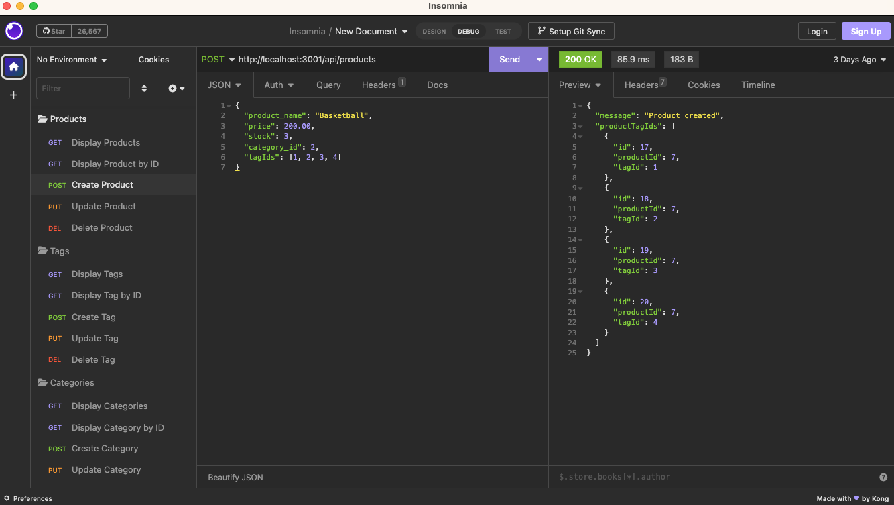

# ReadMe - Module 12 Challenge 📝

## Description 

This app is a object relational mapping system, designed to let a user manage a company's database of products, categories and tags, using Node.js, exspress and sequilize.  With the app, you can create, read, update, and destroy objects using an API interface and modify items including employees, roles, and departments, as well as see advanced metrics about the organization's makeup.  

View more info below, as well as the github repo, a video preview, and a screenshot of the app in action.  

Github: [link here](https://github.com/BenjiCCB/challenge-13)

Video overview: [link here](https://monosnap.com/file/s6M3lDwzyICsd2cmX8caxKlqcx1gZx)

---

## Table of Contents 

* [Descripton](#description)

* [Installation Instructions](#installation-instructions)

* [Usage Information](#usage-information)

* [App License](#app-license)

* [Contribution Guidelines](#contribution-guidelines)

* [Testing Instructions](#testing-instructions)

* [Questions](#questions)

---

## Installation Instructions 

To begin, run NPM install, to add in all necessary node packages.  After this, you'll need to add in your database information to the .env file.  You can then create the database by loading into the mysql shell ('mysql -u root -p', then password) and running 'source db/schema.'  After quitting, run 'node seeds/index.js' to seed the database.  Finally, you can then run 'node server.js' in the terminal and the application will run

---

## Usage Information 

The app provides a full CRUD interface to be able to manipulate elements of the database, using API calls from a source like Insomnia.  Functionality includes:

* Create, read, update, and delete products
* Create, read, update, and delete categories
* Create, read, update, and delete tags

When reading relevant object types, all associated objects will be displayed

---

## App License 

This app is covered under the following license: None

---

## Contribution Guidelines 

This app was developed indepentently, though all suggestions are welcome

---

## Testing Instructions 

Feel free to try finding bugs, although hopefully there shouldn't be any!

---

## Questions 

For more information and questions, please contact me at <bensdecker@gmail.com> or by visiting my [github account](https://github.com/benjiCCB)